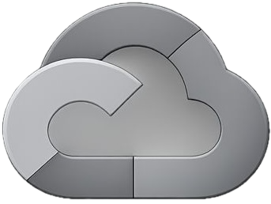
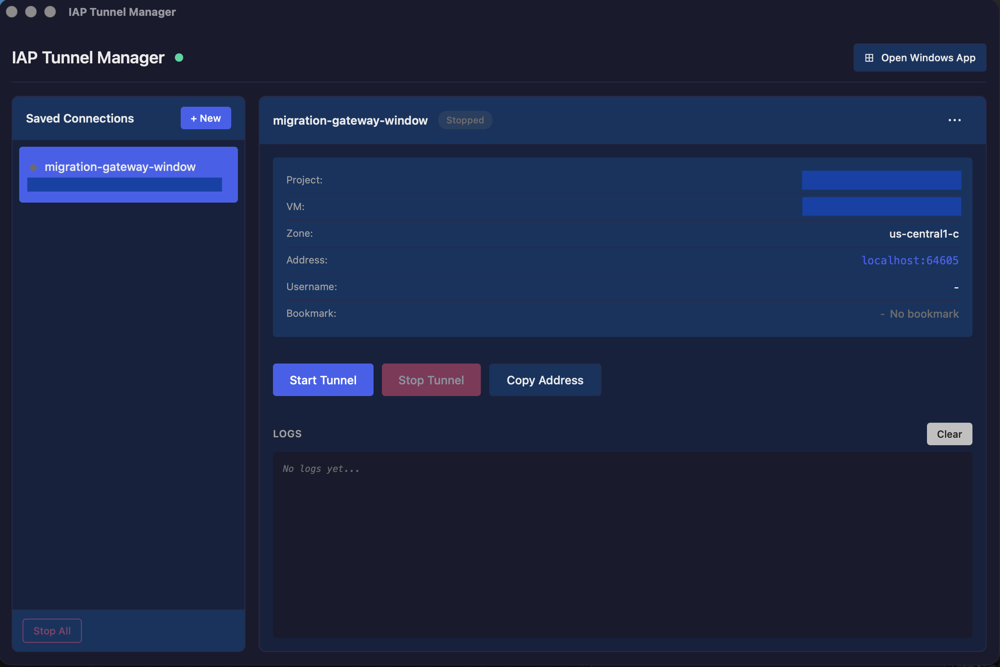
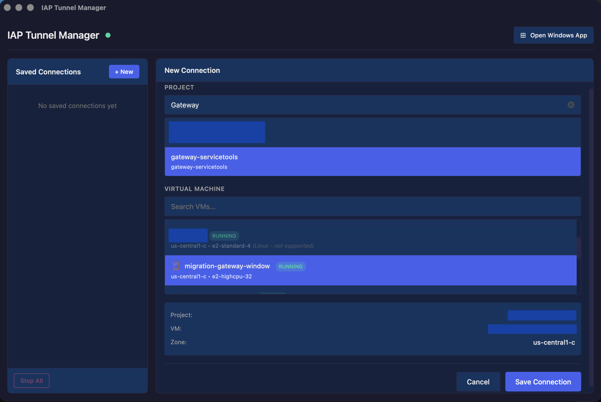
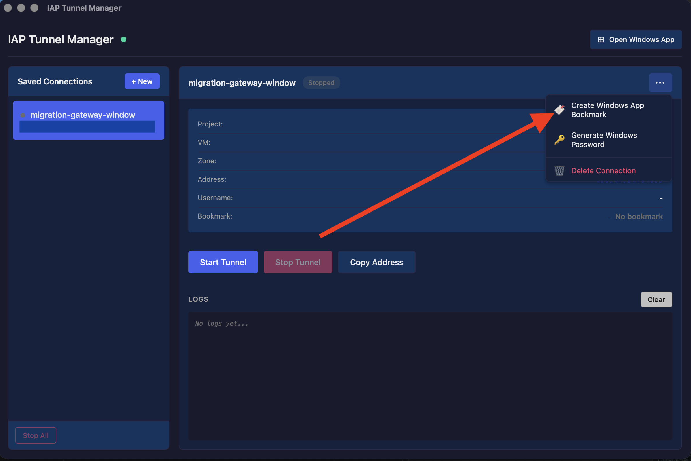
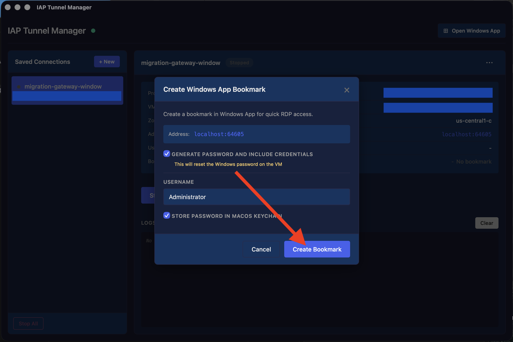
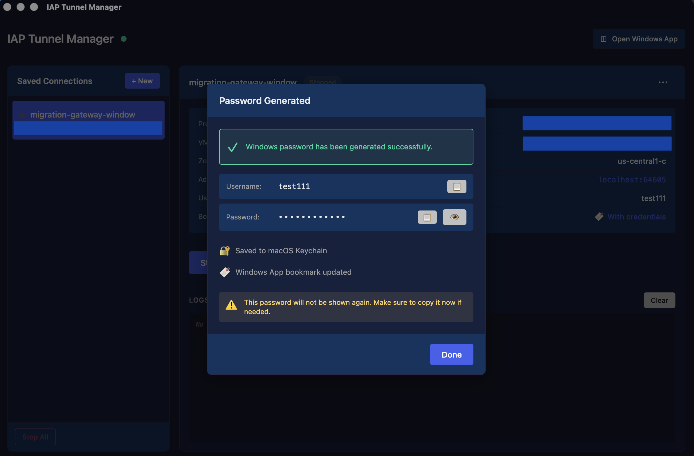

# IAP Tunnel Manager

IAP Tunnel Manager is a macOS desktop application that lets you create IAP (Identity-Aware Proxy) RDP tunnels to your Google Cloud VM instances from anywhere.





## Access Windows VMs from anywhere

IAP Tunnel Manager uses [Identity-Aware Proxy (IAP)](https://cloud.google.com/iap/docs/tcp-forwarding-overview) to connect to VM instances so that you can:

* Connect to VM instances that don't have a public IP address
* Connect from anywhere over the internet
* Apply zero-trust security to your VMs

The application automatically manages IAP TCP tunnels for you, finding free local ports and handling the connection lifecycle.

## Connect to Windows VMs with Remote Desktop


IAP Tunnel Manager makes it easy to establish RDP connections:

* **Auto Port Selection** - Automatically finds free local ports for tunnels
* **Copy RDP Address** - Quick copy of `localhost:<port>` for any RDP client
* **Real-time Logs** - View tunnel connection status and diagnostics
* **Open Windows App** - Launch Microsoft Windows App directly with one click

## Manage VMs across projects



IAP Tunnel Manager gives you a consolidated view of your VMs:

* **Live Search** - Filter projects and VMs as you type
* **Tunnel Management** - Start, stop, and monitor tunnel status
* **Save Connections** - Save frequently used connections for quick access
* **Multi-project Support** - Browse VMs across all your Google Cloud projects

## Windows App Integration

If you have [Microsoft Windows App](https://apps.apple.com/us/app/windows-app/id1295203466?mt=12) installed, IAP Tunnel Manager can automatically create RDP bookmarks with credentials.

### Create a bookmark

Click the **"..."** menu and select **"Create Windows App Bookmark"**:



### Configure bookmark options

Choose to generate a new Windows password and store it securely in macOS Keychain:



### Credentials saved

The password is generated, saved to Keychain, and the bookmark is created in Windows App:



### Ready to connect

Your bookmark appears in Windows App, ready to use:


## Get started

### Installation

Download the latest release from the [Releases](https://github.com/kvysotskyi/go-iap-mac/releases) page.

> **Note:** This app is not signed with an Apple Developer certificate. On first launch, macOS will block it. To allow the app:
>
> 1. Open **System Settings** → **Privacy & Security**
> 2. Scroll down to the **Security** section
> 3. Click **"Open Anyway"** next to the message about IAP Tunnel Manager being blocked
> 4. Confirm by clicking **"Open"** in the dialog
>
> You only need to do this once.


### Configure IAP in your project

#### 1. Authenticate with Google Cloud

This app uses Application Default Credentials (ADC). Authenticate with:

```bash
gcloud auth application-default login
```

#### 2. Required IAM Permissions

Your Google account needs the following permissions:

| Role | Purpose |
|------|---------|
| `roles/viewer` | List projects |
| `roles/compute.viewer` | List VM instances |
| `roles/iap.tunnelResourceAccessor` | Create IAP tunnels |

#### 3. Configure Firewall Rules

Ensure your VPC has a firewall rule allowing IAP traffic:

| Setting | Value |
|---------|-------|
| Source IP range | `35.235.240.0/20` |
| Target | VMs you want to connect to |
| Ports | `3389` (RDP) |

### Connect to a Windows VM

1. **Launch the app** - It will check for valid GCP credentials
2. **Click "+ New"** - Create a new connection
3. **Select a project** - Use the search box to filter projects
4. **Select a VM** - Choose the VM you want to connect to
5. **Save Connection** - Click "Save Connection" to save for quick access
6. **Start Tunnel** - Click "Start Tunnel" to create the IAP connection
7. **Connect via RDP** - Click "Open Windows App" or use "Copy Address" for other RDP clients

## Troubleshooting

### "Application Default Credentials not found"

Run `gcloud auth application-default login` and restart the app.

### "Permission denied" when listing projects

Ensure your account has the `roles/viewer` role at the organization or folder level.

### "Failed to dial IAP"

Check that:
- The VM is running
- You have `roles/iap.tunnelResourceAccessor` permission
- The firewall allows IAP traffic (35.235.240.0/20)

### Tunnel starts but RDP fails

- Verify the VM has RDP enabled (Windows) or xrdp installed (Linux)
- Check that port 3389 is listening on the VM

---

## Development

### Requirements

- Go 1.21+
- Node.js 18+
- [Wails CLI v2](https://wails.io/)

### Install Wails CLI

```bash
go install github.com/wailsapp/wails/v2/cmd/wails@latest
```

### Run in Development Mode

```bash
wails dev
```

This starts the app with hot-reload for frontend changes.

### Build the Application

```bash
# Install frontend dependencies
cd frontend && npm install && cd ..

# Download Go dependencies
go mod tidy

# Build for macOS
wails build -platform darwin/universal
```

The built application will be in `build/bin/`.

### Project Structure

```
go-iap/
├── main.go              # Wails app entry point
├── app.go               # Go backend (GCP APIs, tunnel management)
├── wails.json           # Wails configuration
├── go.mod               # Go dependencies
├── frontend/
│   ├── index.html       # Main HTML
│   ├── package.json     # Frontend dependencies
│   ├── vite.config.js   # Vite configuration
│   └── src/
│       ├── main.js      # Frontend JavaScript
│       └── style.css    # Styles
└── README.md
```

## Technical Details

### IAP Tunnel Implementation

This app uses the [cedws/iapc](https://github.com/cedws/iapc) library which implements the Google IAP SSH Relay v4 protocol. The tunnel:

1. Listens on a local port (127.0.0.1)
2. For each incoming connection, establishes an IAP WebSocket tunnel
3. Proxies data bidirectionally between local and remote endpoints

### API Usage

| API | Purpose |
|-----|---------|
| Resource Manager API | List accessible GCP projects |
| Compute Engine API | List VM instances (aggregated across all zones) |
| IAP TCP Forwarding | WebSocket-based tunnel protocol |

## License

MIT License
